# Assignment 1

## Setting up

If you haven't already, install [git](<https://git-scm.com/>).

You should have a private repository for this course by Monday, 29. August.
It will be listed as `in3110-yourusername` at [https://github.uio.no/IN3110](https://github.uio.no/IN3110).
You should have received an invitation to this repo over the weekend.
If you don't have a repo by Monday, let us know at [in3110@simula.no](mailto:in3110@simula.no).

Clone this repository. Now, create an `assignment1` folder in your git repository. The deliveries for Assignment 1 should be commited there.

## Your First Git Repository

**Task 1**  Add and commit a textfile (1 point).

Add a textfile to the `assignment1` directory. The textfile should be named `myfirstcommit.txt` and contain the string "This is my first commit.". Push the commit to github.

**Note:** Remember to always leave a descriptive commit-message.

**Tip:** When you commit code from the command line,
  git will open a text-editor for you to write the commit message in.
  You can change the text-editor to e.g. nano by writing

```bash
git config --global core.editor "nano"
```

or for [VS Code](https://code.visualstudio.com/docs/editor/versioncontrol#_vs-code-as-git-editor):

```bash
git config --global core.editor "code --wait"
```

**Tip:** Use the -m flag to write the commit-message directly on the command line, without opening an editor.

```bash
git commit -m "This is my first commit."
```


## Recovering Old Versions of Files

With this task, you will learn how to recover old versions of a file.

**Task 2** Commit and retrieve files following instructions 1-5  (1 point)

1.  Add, commit, and push a new file called `friendly_greeting.txt` to your repository. The file should contain a friendly greeting.
2.  Change the file content so the greeting is less friendly, and add, commit, and push the modified file.
3.  Since the greeting is no longer friendly you should ask git to change the name of the text file `friendly_greeting.txt` to `less_friendly_greeting.txt`. Use the command

    ```bash
    git mv friendly_greeting.txt less_friendly_greeting.txt
    ```

4. To fetch the old version, first use

    ` git log`

    to get a list of the commits, and identify the commit containing the old version of the greeting. Note down its commit hash (the string of letters/numbers after "commit ").
    Then use

    ` git checkout COMMITHASH -- friendly_greeting.txt`

    where `COMMITHASH` is the commit hash you found using `git log`. This
    will recover the friendly version `friendly_greeting.txt` from the
    commit you chose, and `git add` it for you.

5. Finally, use `git commit` to
make a commit which recovers the friendly version, and push this commit
to GitHub. Now you will have a friendly and a not friendly greeting version in your repository.


## Dealing with Conflicts in Git

This exercise will use a lot of words to explain a common "error" which frequently happens when git is used for collaboration.

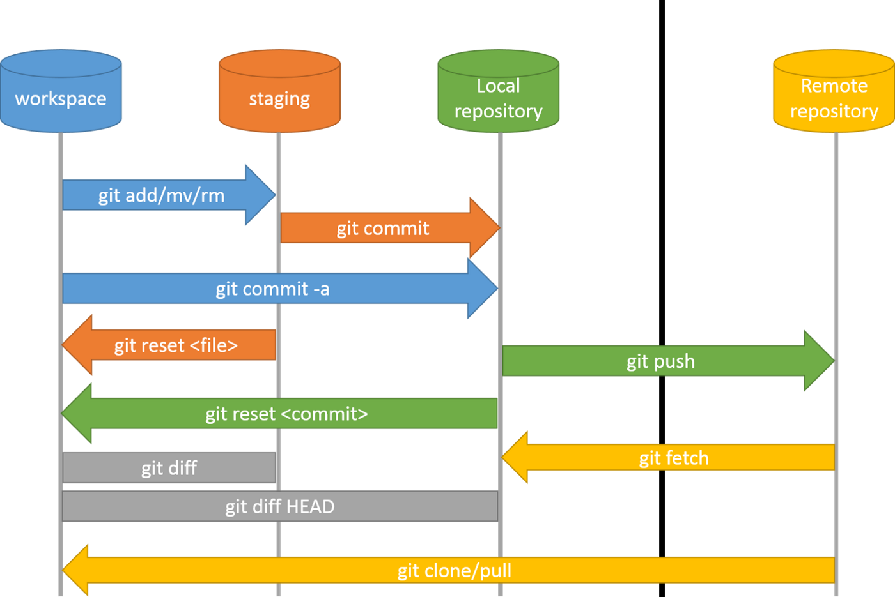


When working on a project it is customary to make a sequence of commits of your code and push these to the remote repository. In git each of these commits will go sequentially "on top of" another commit.

Now, let us assume the repo already contains Commit 1. You and a friend then work on the repo separately. Your friend makes commit A and pushes it to the remote repository. You then make commit B and also attempt to push to the remote repository. Git will then throw an error.

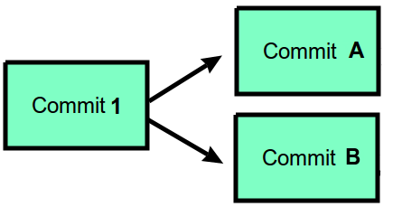

This error will notify you that commit A was made "in between" commit 1 and the commit you are trying to make (commit B), and so won't allow you to push until you have done a `git pull` to get commit A.


While it may have been possible to just pretend commit B was really supposed to go on top of A - maybe A and B are modifying separate files - git won't do that by itself, as this might have unintended side-effects.

When you do `git pull` git will see that you are trying to `pull` commit A which goes on top of commit 1. However, your local copy of the repository already has a commit B on top of commit 1, so completing the `git pull` means you have to `merge` first. This means that you have to make a new `git commit` M which does what commit B did, but on top of commit A instead of commit 1.

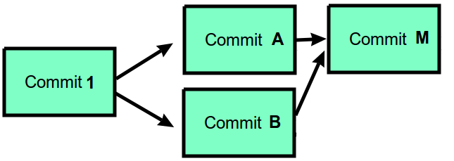


In some cases it is clear how to merge two commits and git will do it automatically for you.

In other cases it is unclear how to merge the two commits. Git will then raise a *merge conflict* that you have to resolve manually.


### Dealing with merge conflicts
Let's simulate such a scenario and fix the resulting merge conflict.

**Task 3**  Resolve a merge conflict following steps 1-4 below (1 point):

1.  Add, commit, and push a new file `gitconflict.txt` with the
    contents

        Here's a line

        Hello world!

        Here's another line

    to your git repository.

2.  Copy the directory on your local machine containing your git
    repository to a different directory, e.g.

    ```bash
    cp -r . ../my-repo-copy
    ```

3.  In the two different local copies of your repository, make different
    changes (For example, change the line "Hello world!" to "Hello world
    from A!" in one, and "Hello world from B!" in the other.) to
    `gitconflict.txt` and commit them separately.

4.  Then, attempt to push the changes of both repositories to GitHub.
    The first push will be fine, but the second one will fail and tell
    you the remote repo has commits that your local repo does not. It will suggest you pull, so do
    that. This will cause a merge conflict which you will need to
    resolve manually. Your error will look something like this:

        Auto-merging gitconflict.txt
        CONFLICT (content): Merge conflict in gitconflict.txt
        Automatic merge failed; fix conflicts and then commit the result.

    If you type `git status`, you will see that git started merging
    stuff automatically, but didn't know what to do with
    `gitconflict.txt`, so git left it in a half-merged state. Opening
    the copy of `gitconflict.txt` in the second repository shows you
    something like this:

        Here's a line

        <<<<<<< HEAD
        Hello world from B!
        =======
        Hello world from A!
        >>>>>>> daa83f4b022b0b5b61a40fef6bb8eedacfe9fd5a

        Here's another line

    Notice that the line on which conflicting changes was made has been
    replaced by autogenerated text from git. The text above
    `=======` is what commit B wants this line to contain, while the
    text below is what commit A wants this line to contain. The text after `>>>>>>>` is the commit hash of commit A

    To finish the merge, modify the whole chunk to be whichever
    you want the 'final version' of the file to contain. (For example,
    maybe "Hello world from everyone!".) Then save the file.

    You can then `git add` and `git commit` your changes and push them.
    Having done so, try typing `git log --graph` to see a visualization
    of what happened. Good job, you just resolved a conflict!

    **Tip:** Text-editors such as Visual Studio Code have support for git, including viewing file changes since the last commit and resolving merge conflict.

## Creating A Pull Request

In software development, you will often work with a team on a specific project. To propose changes and collaborate on a project an important
tool is the so-called "Pull Request". In later assignments you will make pull requests as a part of the peer review.

Consider the following example: Sarah owns a project repository and Bill
would like to suggest an improvement or new feature to that project. The
procedure for Bill's code contribution consists of five steps:

1.  Bill creates a *copy* of Sarah's repository.
    This copy is called a 'fork'.

2.  Bill implements his improvements or new feature and pushes these
    changes to his 'fork'.

3.  Bill sends a request to Sarah to include his changes. He does this
    by creating a 'pull request'.

4.  Sarah reviews Bill's changes and can either reject or accept the
    pull request. If rejected, Bill can commit further improvement to
    his fork until Sarah is happy.

5.  Once the pull request is accepted, Sarah merges the pull request.
    This means that Bill's code changes will be merged into Sarah's code
    repository.

The figure below visualizes these steps. Note that this procedure even
works if Bill does not have write access to Sarah's repository.

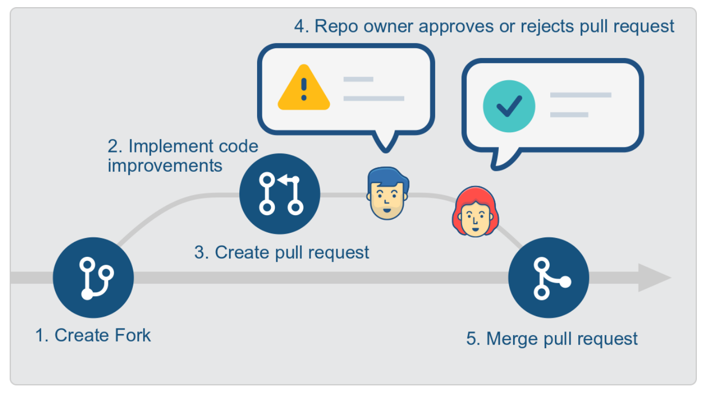

**Task 4**  Make a pull request following steps 1-5 below (2 points).

1.  Go to your IN3110/IN4110 repository. Click on the 'Fork' button on
    the top right to create your personal copy of the repository.

    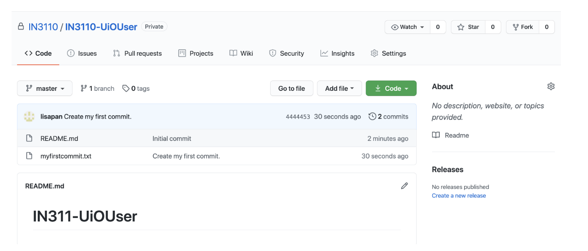

    This could open up a dialogue window asking where to fork your
    repository to. Make sure you choose your personal UiO User name.

    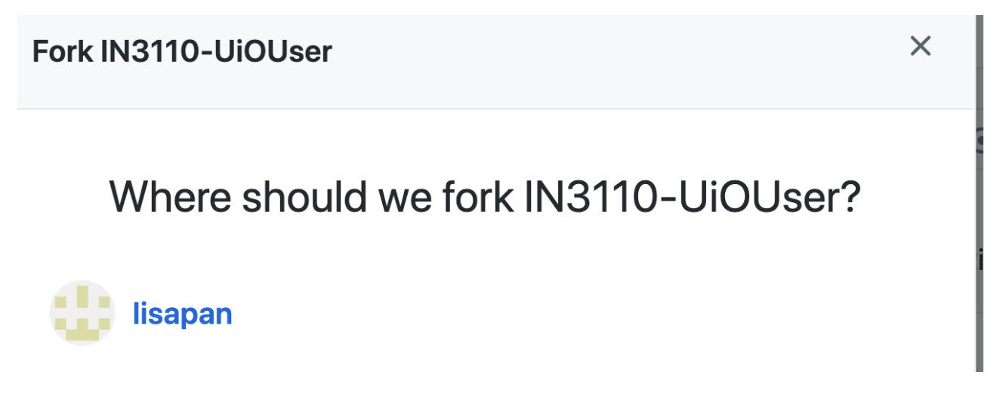

2.  Once forked, you will be forwarded to the repository page of your
    personal copy.

    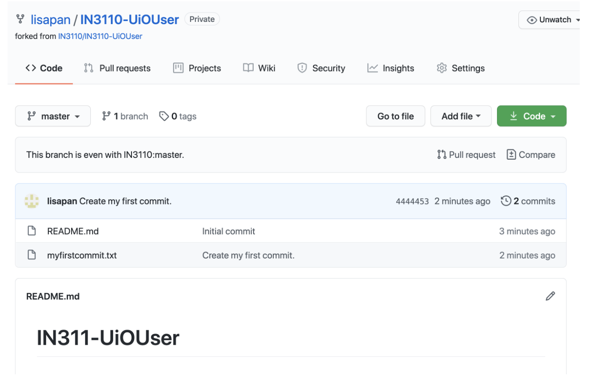

    You can [clone]( <https://docs.github.com/en/github/creating-cloning-and-archiving-repositories/cloning-a-repository-from-github/cloning-a-repository>) this repository as usual to your computer.

3.  Modify the textfile `myfirstcommit.txt` in your forked repository by
    adding a line to it saying "I edited this file." Commit and push
    these changes to your forked repository. **Note:** Don't forget to
    write a commit message mentioning what you changed. Your modified
    file in your forked repository will look like this.

    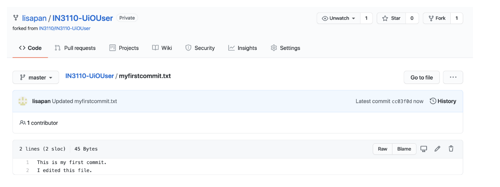

4.  It is time to create a 'pull request'. Click on the flag "Pull
    request" in your forked repository and click on the green button
    "New pull request".

    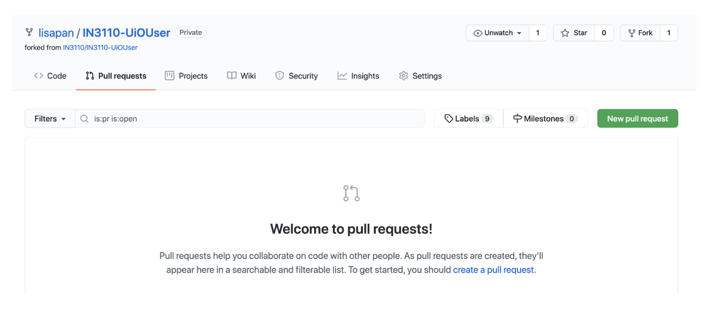

    Make sure that the base repository is the "IN3110/IN3110-UioUser"
    repository. Merge your modifications from your fork into that
    repository.

    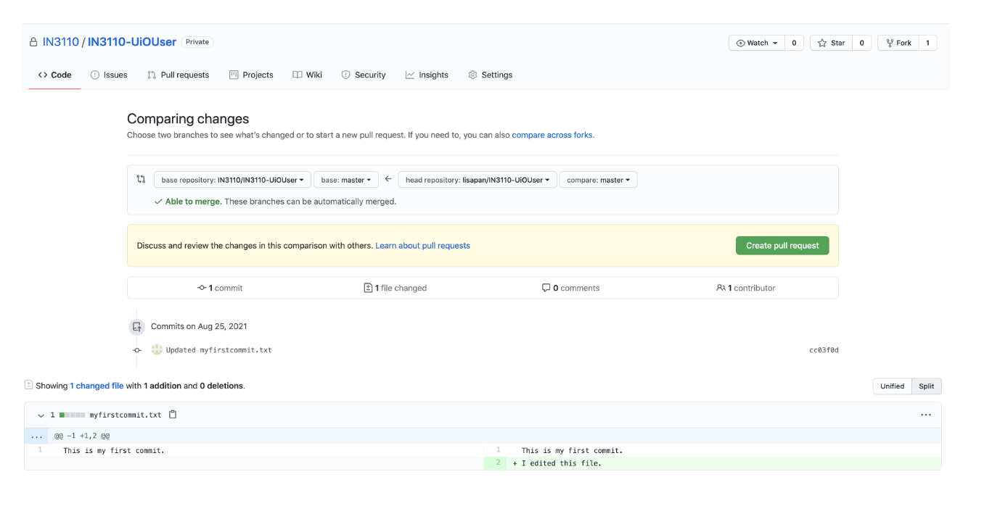

    Leave a short descriptive message with the pull request as well as a
    short comment describing what you did (see image below). Push the button "Create pull request".

    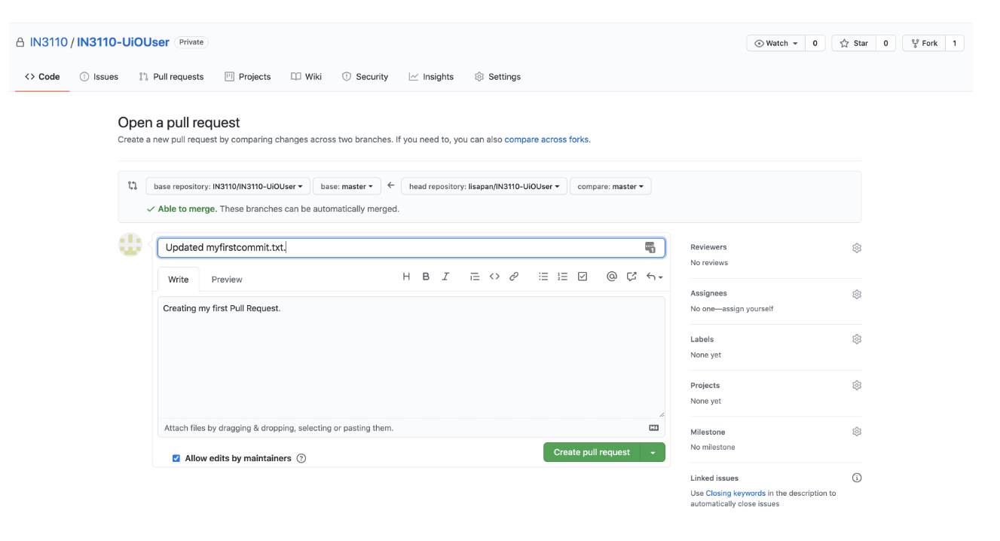

5.  You will now see an open "Pull request" at the
    "IN3110/IN3110-UioUser" repository. To close the pull request, you
    can merge it. Finish the pull request by confirming the merge.

    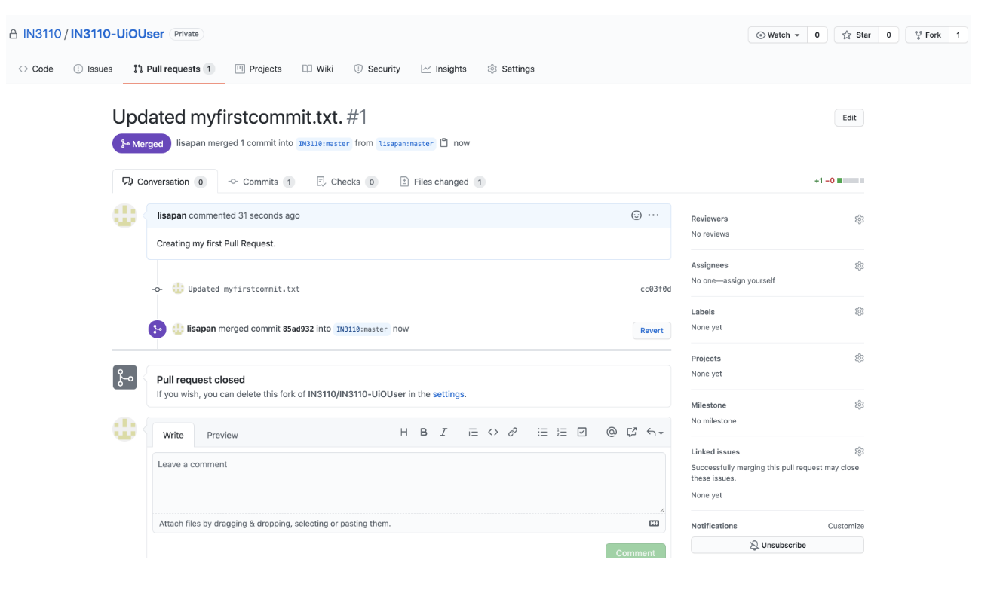

    Congrats! You finished your first pull request! You should be able
    to see a "closed" pull request under the flag "Pull requests" as
    below.

    
