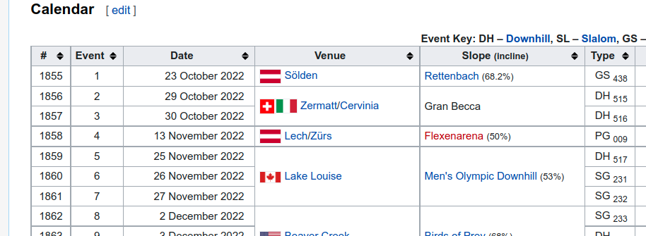
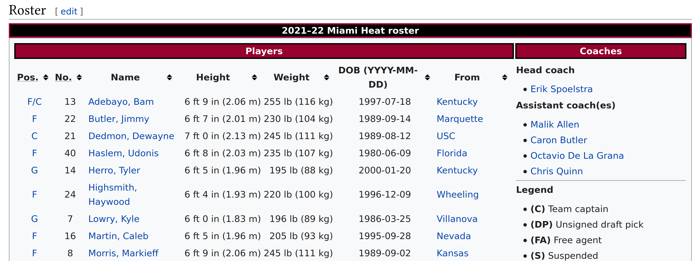
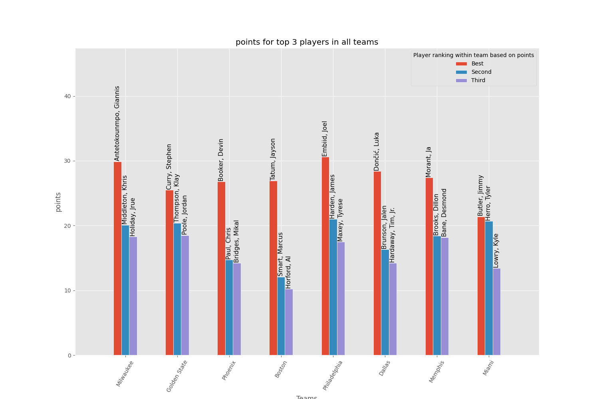

## Updates

- 2022-10-26 - add tip for sorting dates with `match.start()`
- 2022-11-01 - noted that `plot_best` should create the `NBA_player_statistics` folder if it does not exist

---

In this assignment you will be using `python`, regular expressions (`re`) and `beautifulsoup` for data mining. You will learn how to get the html code that makes up a website, parse through it for relevant information and display the results. At the end there is a bonus task for playing wikipedia golf.

Before you start, please note the following:

- Your solution to this mandatory assignment needs to be placed in the directory `assignment4` in your GitHub repository. The repository has to contain a `README.md` file with information on how to run your scripts, required dependencies and packages (versions the code ran with and operating system) as well as how to install them.
- We have written a code skeleton for you containing the functions you need to write and corresponding tests. Make sure to keep the function names, arguments, and return types as specified as this makes grading easier. _However, you are free to write whatever helper functions you want._
- Download the skeleton [here](./assignment4.zip),
  or browse [on GitHub](https://github.com/UiO-IN3110/UiO-IN3110.github.io/tree/main/assignments/assignment4/code).
  It should create the `assignment4` directory in your repo.
- Your code needs to be well commented and documented. **All** functions need to have docstrings explaining what the function does, how it should be used, an explanation of the parameters and return value(s) (including types).
- Writing tests to run with `pytest` is not just a great way to check your code, but it also shows how you expect your code to work. Writing your own tests is greatly appreciated by the graders as it makes it much easier to grade your assignment.
- We have provided a collection of tests (in the `tests` directory in the code skeleton) representing a subset of the requirements for the assignment. All of these tests should **pass unmodified** if the assignment is complete and correct.
- This assignment will be followed by a peer-review. Delivery of the assignment is required for participation in the peer review.

A last tip on regex:

- As you will soon find out, regex can be extremely powerful, but the syntax can be difficult to read and debug. We recommend [regex101.com](regex101.com) as a great resource for testing and understanding your regular expressions. Remember to document (with comments) how the regex is expected to work.

# Sending HTTP requests

In order to parse html and become the regex master of the year, you need to access the html body first. This can be done using the python `requests` [module](https://requests.readthedocs.io).

`requests` can be installed with pip or conda:

    python3 -m pip install requests

To retrieve data from any destination, the most common approach is the
**GET** Request. This is the most-used HTTP method. In our example, we
will use the get request to fetch data from the website of choice. The result will be printed out as html data. The request module can be imported and used as shown below.

```python
#import the module
import requests

# grabbing the content of https://en.wikipedia.org/wiki/URL
resp = requests.get("https://en.wikipedia.org/wiki/URL")

# get() method returns a response object
print(resp.text)
```

This will print the html body

```html
<!DOCTYPE html>
<html class="client-nojs" lang="en" dir="ltr">
  <head>
    <meta charset="UTF-8" />
    <title>URL - Wikipedia</title>
    ... #shortened for the purpose of viewing
  </head>
</html>
```

Often you are interested in a specific type of data. With GET requests, you can send parameters in the form of query strings. How does that work? If you were to construct the URL by hand, the data you are interested in would be given as key/value pairs in the URL after a question mark, e.g. <https://httpbin.org/get?key=val>. Using get requests, you can provide these arguments as a dictionary of strings, using the params keyword argument.

For a real example, you can look at the following snippet:

```python
import requests

params = {'user_name': 'admin', 'password': 'password'}
r = requests.get('http://httpbin.org/get', params=params)

print(r.url)
http://httpbin.org/get?user_name=admin&password=password

# print the.text content of the request
print(r.text)
```

This returns

```json
{
  "args": {
    "password": "password",
    "user_name": "admin"
  },
  "headers": {
    "Accept": "*/*",
    "Accept-Encoding": "gzip, deflate",
    "Host": "httpbin.org",
    "User-Agent": "python-requests/2.22.0",
    "X-Amzn-Trace-Id": "Root=1-5f841066-0c0ea5084573be8a230feaea"
  },
  "origin": "51.175.234.27",
  "url": "http://httpbin.org/get?user_name=admin&password=password"
}
```

> **Task 1:** (2 Points) Complete the function `get_html` in `requesting_urls.py` which makes a request for a url from a given website.

The function should be able to optionally take in parameters that are passed to the get function. There should be an optional argument allowing to specify that the response url and text will be saved to a text file with a specified name `optionalargument.txt`. If the optional argument is not set, the html text should be returned.

You should implement `get_html` so that it be called in the following ways:

```python
html_str = get_html(url)
html_str = get_html(url, params={"key": "value"})
html_str = get_html(url, params={"key": "value"}, output="output.txt")
```

You can test your implementation by running:

    pytest -v tests/test_requesting_urls.py

# Regex for filtering URLs

Next, you will be making functions for finding urls in a body of html using regex:

    list_of_urls = find_urls(html_str)

You will be using the `re.findall` method taught in the lecture.

> **Task 2** (4 Points) Complete the file named `filter_urls.py` which includes a function `find_urls` that receives an html string and returns a list of all urls found in the text.

You can test your implementation by running:

    pytest -v tests/test_filter_urls.py

To help you get started we have added a function `find_img_src(html: str)` to `filter_urls.py` that uses regex to find the `src` attribute of all `img` tags. You will need to adapt this to find the `href` attribute of `a` tags, and handle the additional processing of evaluating URLs that are paths on the same host (these start with `/`).

Note that:

- We only consider urls that are anchor hyperlinks with the `<a>` HTML tag. Links to in-page anchors (start with `#`) should be ignored.
- In order to handle url paths, the function should have an optional parameter to receive a base_url.
- The function should ignore fragment identifiers (link targets that begin with `#`). I.e., if the url points to a specific fragment/section using the hash symbol, the fragment part (the part starting with `#`) of the url should be stripped before it is returned by the function.

_You should not use Beautiful Soup or any HTML parser in Task 2, only regular expressions._

**Example of fragment:** The string
`https://www.example.com/somepage#someidentifier` becomes
`https://www.example.com/somepage`
after stripping the fragment.

**What is a url path and what is a base url?** Consider the wikipedia page for Giannis Antetokounmpo, for which the full url is https://en.wikipedia.org/wiki/Giannis_Antetokounmpo. A
_full_ URL is the entire address, including the protocol (https),
hostname (en.wikipedia.org), and path (/wiki/Giannis*Antetokounmpo). A *path\* URL is only the last part (starting with '/'), and does not include the protocol or hostname. As an example, Wikipedia pages (with base url https://en.wikipedia.org) will have the following path link to Giannis Antetokounmpos wiki page:

```html
<a href="/wiki/Giannis_Antetokounmpo" ...
```

> **Task 3** (1 point) Further, make a function `find_articles` that calls `find_urls` and
> returns only urls to Wikipedia articles. This function should also use
> regex and **be able to handle any chosen language**
> ([no.wikipedia.org](no.wikipedia.org),
> [en.wikipedia.org](en.wikipedia.org) etc).

Specifications:

- You should only return normal Wikipedia articles, so no special namespace article (or files). While you could exclude just the
  [specific reserved namespaces](https://en.wikipedia.org/wiki/Wikipedia:Namespace), **it is sufficient to exclude all articles with a colon**. This will exclude some actual articles (for example <https://en.wikipedia.org/wiki/Avengers:_Endgame>, but we won't
  deduct points for it.
- You should only find urls that are in the `href` attribute of a tag. It is _not always_ the first attribute which means matching just `<a href=` is not enough, but you can assume some things about the use of special html characters since regex cannot parse html alone.

The found urls should be returned as a `set`.
If an optional `output` filename argument is specified, the URLs should be written to this file, one URL per line.

**You should not use Beautiful Soup or any HTML parser in Task 2 and 3, only regular expressions.**

# Regular Expressions for finding Dates (IN3110 optional & IN4110 required)

In this task, you will be making functions for finding dates in a body of html using regex.

> **Task 4** (10 Points, IN3110 optional, IN4110 required)
> Create a script named `collect_dates.py` that
> includes a function `find_dates` that receives an html string and returns a list of all dates found in the text in the following
> year/month/day format:

```
1998/10/31
1998/11/04
1999/01/13
```

The `collect_dates.py` provided has a skeleton of the `find_dates` function, and `tests/test_collect_dates` has some tests that should be able to pass if you have completed the task. You can check this by running

    pytest -v tests/test_collect_dates.py

Specifications:

- You only need to consider the [wikipedia standardized formats](https://en.wikipedia.org/wiki/Template:Date) for dates. These are the four formats:

```
DMY: 13 October 2020
MDY: October 13, 2020
YMD: 2020 October 13
ISO: 2020-10-13
```

- The dates **returned** should be formatted as `year/month/day`. Month and day should be zero-padded,
  e.g. producing `2001/01/01`, not `2001/1/1`.
  The returned dates should be a _list_,
  matching the order of occurrence in the document.

- There should be an optional argument `output` allowing to specify that the resulting list will be saved to a text file with the name given,
  e.g.

```python
find_dates("<html....", output="dates.txt").
```

Use regular expressions in this task. One strategy could be using
the `re.findall` and `re.sub` methods. This will give us a list of all the strings matching your regular expression and allow you to change the formatting. But you are free to implement how you see fit, as long as you use regular expressions.

Steps that you likely will need to cover within this task are the
following

- get html

- use `re.findall` to extract a list of dates in the formats DMY, MDY,
  YMD, ISO

- convert the date with `re.sub` or another method.

Feel free to divide your regular expressions into small building blocks containing a day, month, and year part. The month december could be a building block represented like this matching dec or december with optional capitalization.

```python
dec = r"\b[dD]ec(?:ember)?\b"
```

To check for the month, you might want to define all the months in such
a pattern and match these like this for december and november

```python
months = rf"(?:{nov}|{dec})"
```

You also have to consider matching the ISO format, where months are represented as digits.
Take into account that months represented by a
single digit have a leading zero, e.g. 06 for june.

```python
iso_month_format = r"\b(?:0\d|1[0-2])\b"
```

Using the building blocks you created you can find the DMY format for
example using the following expression:

```python
# defining DMY format
dmy = rf"{day}\s{months}\s{year}"

# finding all dmy format matches using re.findall
re.findall(rf"{dmy}", html_text)
```

This may not be the most efficient way nor the only possible solution,
but it might help defining the whole regular expression (or expressions) you are about to
create.
You **do not** need to express all the possible formats in a single expression.

For the "year" you can assume that years will have at least 4 digits,
e.g. 1000 and later.

For converting the date with regular expressions from DMY, MDY, YMD, ISO
to YYYY/MM/DD, you can split the conversion into two steps. Assuming you
have a list of dates you extracted you can first reorder all formats
using `re.sub`. One example for the DMY format:

```python
# reformat DMY as Y/M/D
date_element = re.sub(rf"({day})\s({month})\s({year})", r"\3/\2/\1",
                      date_element)
```

In the second step you can replace the months names by the number that
represents that month.

One option to replace the string for the month with the digit would be
using the `startswith()` method. An example snippet is shown below.

```python
# replace december string with digits
if month.lower().startswith("dec"):
    # Your Code
```

If you find yourself iterating over the whole document multiple times,
it may be useful to track [`match.start()`](https://docs.python.org/3/library/re.html#re.Match.start),
which is the location in the document of the match as an integer
in order to return a properly sorted list of dates.

Here's an example of sorting strings by an associated index,
after storing them in tuples:

```python
from operator import itemgetter

unsorted_list = [(100, "second"), (10, "first")]
# sort list by the first element in each tuple
sorted_list = sorted(unsorted_list, key=itemgetter(0))
# [(10, "first"), (100, "second")]
# extract items after sorting
sorted_items = [item[1] for item in sorted_list]
# sorted_items = ["first", "second"]
```

**Note:** You should not use Beautiful Soup or any HTML parser in this
task, only regular expressions.

# Making your life easier with Soup for finding dates

Need to plan your watch parties for the upcoming skiing season? Why not
send out all the dates and times to your friends that are also into
(watching) skiing? In this task you will use the Python tool
BeautifulSoup to parse HTML. You will extract the datetime objects
representing the event "date", a regular expression fetching the
"venue" and the discipline "type".

You can install Beautiful Soup via:

```bash
python3 -m pip install beautifulsoup4
```

Make sure that you are running python3 and your pip points to the right
python version as well. If you are running into issues, we
recommend setting up a `virtualenv` or a `conda env`,
or running on IFI.

**Tip:** It will really help for this task if you take a few minutes to familiarize yourself with the HTML structure of web pages. We recommend you navigate to (for example) [the wikipedia page on sports](https://en.wikipedia.org/wiki/Sport), right click and select 'Inspect element'. Alternatively, right click on the web page and view the page source. Can you find the table in this article? Hint: Search for `<table class="wikitable">`.

We would like to extract the table from the page now. First, we need to grab the HTML from the web page, so that we have something to parse through. Here is an example:

```python
from bs4 import BeautifulSoup
import requests

url = "https://en.wikipedia.org/wiki/Sport"

response = requests.get(url)
soup = BeautifulSoup(response.text, "html.parser")

#check the title of the wikipedia page
print(soup.title)

# find the popularity table as the first table
# after the heading "Popularity"
soup_heading = soup.find(id="Popularity")
soup_table = soup_heading.find_next("table", {"class": "wikitable"})
```

Now we need to know how to navigate the table. To figure out which column holds which information, we can look at the header. We will use the html `<th>` tag (short for "table header"), which defines the header cell in an html table. An html table has two kinds of cells: header cells created with `<th>` elements and data cells created with `<td>`
elements.

To iterate through the data in the table, we first need to access the table rows. Table rows are defined by the `<tr>` tag. A `<tr>` element contains `<td>` or `<th>` elements. The table headers will be extracted via `<th>` elements, while the table _data_ via `<td>`.

In the script `time_planner.py`, we are going to write functions to create a schedule from HTML, specifically https://en.wikipedia.org/wiki/2022–23_FIS_Alpine_Ski_World_Cup .



> **Task 5:** (3 points) Complete the function `extract_events(url)` in `time_planner.py` that extracts the data in the date, venue and discipline column. This function should take the already-found `table` tag, and parse the data, returning a pandas DataFrame.

The DataFrame should have (at least) the three columns:

- Date
- Venue
- Type

**Note** Looking at the wikipedia table above, you might notice that some row share the venue/slope column. Thus you will need to deal with the colspan and rowspan attributes, where a single cell (e.g. venue) may be used across multiple dates. Your resulting data should have a row for each.

> **Task 6** (3 points) Complete the function `render_schedule` in `time_planner.py`, which should take the events DataFrame returned by extract_events, and render it to [Markdown](https://github.com/adam-p/markdown-here/wiki/Markdown-Cheatsheet#tables), returning the markdown as a string.

https://markdownlivepreview.com is a handy tool for previewing your markdown rendering to make sure it's correct. Visual studio also offers rendering of markdown.

The schedule will contain a table with columns, which represent the date, venue, and discipline. The discipline should be the _full name_ of the discipline, not the abbreviation (i.e. `Slalom` not `SL`).

> **Task 7** (2 points) Tie all these together by completing the function `time_plan` in `time_planner.py`, that takes a url and returns the rendered markdown. It should:
>
> 1. get the HTML of the page, given the URL
> 2. parse through the html using `BeautifulSoup` and finds the main
>    table in the calendar section
> 3. extract events from the table, using `extract_events`
> 4. render those events to markdown with `render_schedule`

An example schedule could look like this:

```markdown
| Date            | Venue            | Type         |
| :-------------- | :--------------- | :----------- |
| 23 October 2022 | Sölden           | Giant Slalom |
| 29 October 2022 | Zermatt/Cervinia | Downhill     |
| 30 October 2022 | Zermatt/Cervinia | Downhill     |

...
```

Upon completing Tasks 5-7 you should check that our corresponding tests pass:

`pytest tests/test_time_planner.py`

## NBA Player Statistics Season 2021/2022

Go sportsball! Let's pretend you are into basketball. After this unpredictable season, you really want to dive into the player statistics. Lucky you! In this task you are going to write a script `fetch_player_statistics.py` which visits the [2022 NBA playoffs](https://en.wikipedia.org/wiki/2022_NBA_playoffs) website on wikipedia, collects, and plots some player statistics.

This task can be broken down into two subtasks:

1.  Given a team url, get the list of players.
2.  Given a player url, get their statistics.

As in the previous task, we will use `BeautifulSoup` for parsing.

### Get the list of players, given a team URL

> **Task 8:** (5 points) In this step, you will write the `get_players` function, which should take a `team_url` and return a list of all URLs for _players_ on that team.

You should test your implementation on all the teams playing in the semi finals in the NBA. Use `get_teams(url: str)` to fetch all the teams and their corresponding wikipedia pages. One example will be `https://en.wikipedia.org/wiki/2021%E2%80%9322_Miami_Heat_season'`. The player roster for Miami will be on the page in a table with the heading 'Roster', which looks like:



`get_players(team_url)` should:

1. fetch the team page
2. locate and parse the roster table
3. return a list of dictionaries with the player `name` and `url`, for example:

```python
get_players("https://en.wikipedia.org/wiki/2021%E2%80%9322_Golden_State_Warriors_season")
```

should return

```
[{'name': 'Chiozza, Chris(TW)',
  'url': 'https://en.wikipedia.org/wiki/Chris_Chiozza'},
 {'name': 'Curry, Stephen',
  'url': 'https://en.wikipedia.org/wiki/Stephen_Curry'},
  ...
```

### Given a player URL, get their statistics

Fantastic, let's start on the player statistics section!
We now have a URL for every player on every team.
Player pages have a table of statistics for their whole career, which looks like:


> **Task 9:** (5 points) Write a function `get_player_stats(player_url, team)`, which should:
>
> 1. fetch the player page
> 2. locate the statistics _for their team_ in the 2021-22 **NBA Regular Season** (some players switch teams during the season)
> 3. extract the points (PPG), rebounds (RPG), and assists (APG) as numbers.

Sometimes there's an asterisk (`*`) on a stat.
Make sure to remove it before trying to parse it as a float.

For example,

```python
get_player_stats("https://en.wikipedia.org/wiki/Stephen_Curry", "Golden State")
```

should return something like

```
{'rebounds': 5.2, 'assists': 6.3, 'steals': 1.3, 'blocks': 0.4, 'points': 25.5}
# only 'points', 'assists', and 'rebounds' are required
```

### Comparing and plotting players

At this point, we have player statistics for all players on 8 teams. That's a lot of data to deal with! We want to compare the "best" players,
which we'll define as highest points per game.

The three best players of each team make it into our comparison pool. Since we take the 3 best players of each of 8 teams, we will end up comparing **24 players in total**.

If statistics for a player is missing, it is fine to ignore this player. Since you are only selecting the top 3 from each team you can give these people the lowest possible score of 0. This way, they are not included.

We want to compare these selected players with respect to points per game, assists per game, and rebounds per game.

Therefore, we will plot the players over the points/assists/rebounds. You can choose your favorite plotting tool for this. We would like to have players of each team grouped together (this can be color-coded or with a bracket, or another visualization technique).

> **Task 10** (5 points) Tie task 7 and 8 together in one function `find_best_players(url)`, which should:
>
> 1. call `get_teams` to get the list of (8) teams
> 2. call `get_players` for each team, to get the list > of players for each team
> 3. call `get_player_stats` for each player, to get the statistics dictionary for each player
> 4. filter the players for each team to select the top 3 points-scorers
> 5. create the `NBA_player_statistics` folder if it does not exist (the current working directory, not an absolute path).
> 6. plot the top 3 players for each team (24 players total) in each of 3 statistics (points, assists, rebounds)
> 7. save the (3) plots in appropriate file format for your plotting tool, e.g. `NBA_player_statistics/points.png`

Visualization goals:

- who is on the same team?
- who has the top stats?
- what stat is being plotted?



There are lots of ways to do the plotting.
We have provided a sample plotting function in `example-plot.py`, which uses matplotlib.
You can use this for a reference.

**Files to Deliver in this Subtask** Create a folder
`assignment4/NBA_player_statistics` where you store all the plots created in this task.

_Files Required in this Subtask_

- `fetch_player statistics.py`
- `NBA_player_statistics/points.png`
- `NBA_player_statistics/assists.png`
- `NBA_player_statistics/rebounds.png`

## Challenge - Wiki Race with URLs (5 bonus points and a prize for the winner!)

You have probably heard of golf. You try to get the ball into the hole with the least amount of hits. Let's play some Wikipedia golf.

Write a function using what you've done in the first tasks that finds the shortest path
(in number of urls to visit)
from
https://en.wikipedia.org/wiki/Parque_18_de_marzo_de_1938 to
https://en.wikipedia.org/wiki/Bill_Mundell using only urls in
Wikipedia articles.
The function should work with any two wikipedia urls.

```python
from wiki_race_challenge import find_path
path = find_path(start, finish)
assert path[0] == start
assert path[-1] == finish

print(f"Got from {start} to {finish} in {len(urls)-1} links")
```

The main objective is to find the shortest path. You can expect to work on the english wiki only for this task. The websites given will be your test case.

Points are given for writing a script that finds the shortest path in a finite amount of time. You can test your implementation by finding the shortest path lengths between these two wikipedia articles:
https://en.wikipedia.org/wiki/Nobel_Prize and
https://en.wikipedia.org/wiki/Array_data_structure.

In order to assign a winner, we will evaluate this for 2 undisclosed urls. The most efficient (and correct) script will win a prize.

**Note:** You are going to be on english wikipedia en.wikipedia.org.

**You have to use python ;)**

**Files to Deliver in this Subtask**

- `wiki_race_challenge.py`

## Turning it in

- Remember to push to `https://github.uio.no/IN3110/IN3110-yourname`. ** Not your fork at `https://github.uio.no/yourname/IN3110-yourname`**!
- All files should be in the folder `assignment4/` (we will not grade files delivered elsewhere)
- You should have these files (exact names required):
  - assignment4/requesting_urls.py
  - assignment4/filter_urls.py
  - assignment4/collect_dates.py
  - assignment4/time_planner.py
  - assignment4/fetch_player_statistics.py
  - assignment4/NBA_player_statistics/points.png (file extension will depend on plotting tool)
  - assignment4/NBA_player_statistics/assists.png (file extension will depend on plotting tool)
  - assignment4/NBA_player_statistics/rebounds.png (file extension will depend on plotting tool)
  - assignment4/wiki_race_challenge.py (optional)
- All tests in the tests directory (`pytest -vv tests`) should pass without modification.
  Passing all of these tests is necessary to receive full credit.
