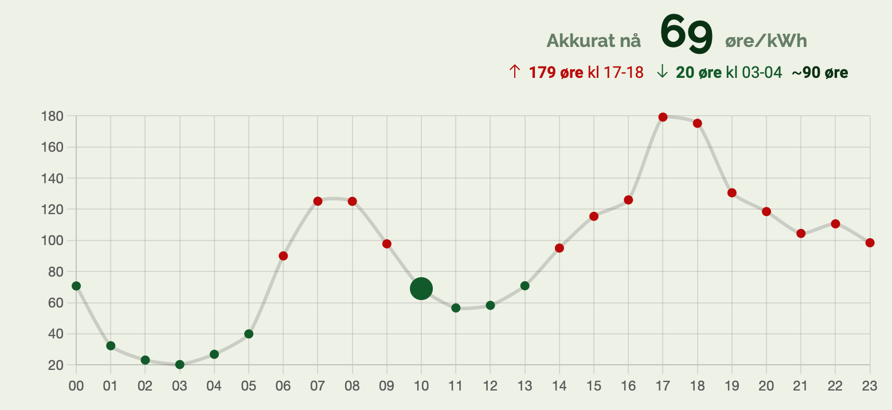
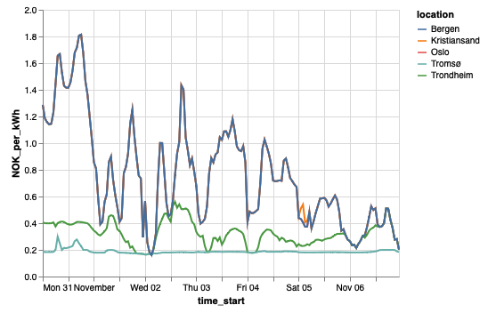
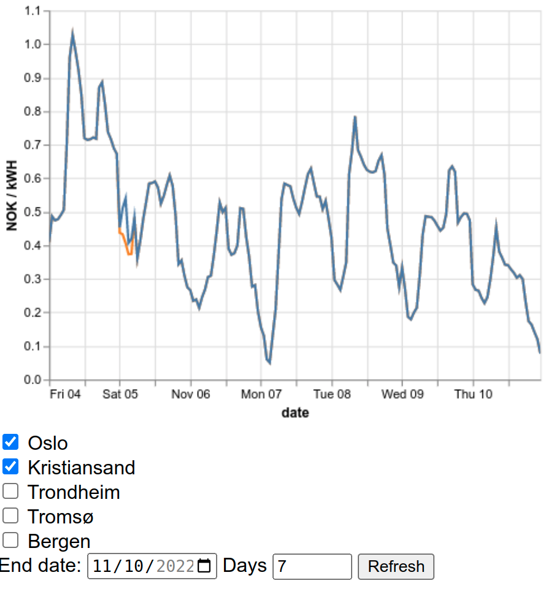
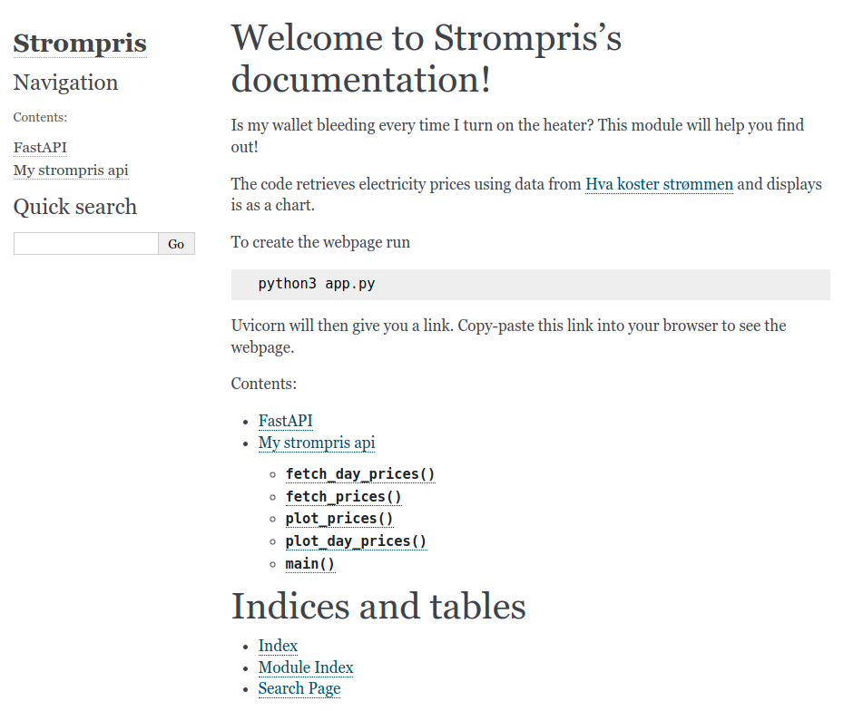
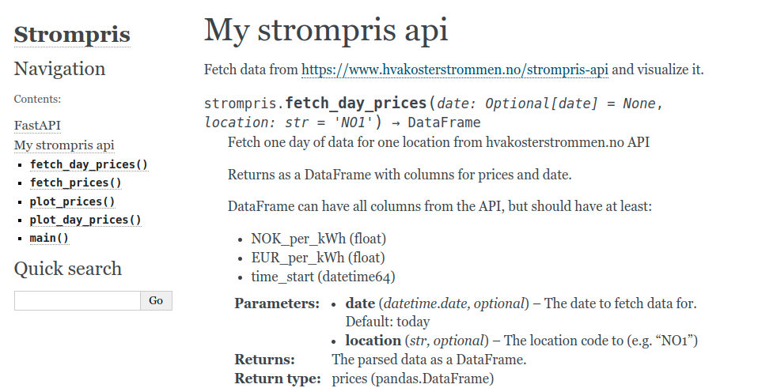
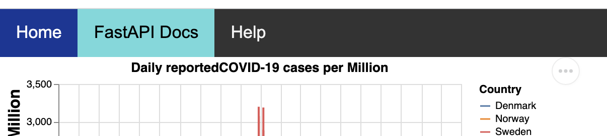
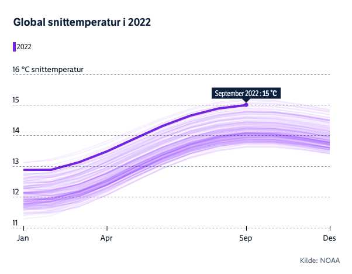

In this assignment we will delve into the new national past-time: Obsessively checking electricity prices. To be more precise, you will be building a web-based visualization of energy prices in Norway, using the Hva Koster Strømmen API: https://www.hvakosterstrommen.no/strompris-api. Your implementation will be based on on the following libraries:

- altair
- fastapi
- pandas
- requests



## General information

As usual, you can download the [code skeleton](./assignment5.zip),
which you should extract to the `assignment5` folder in your in3110 repo.
You can also browse the source [on GitHub](https://github.com/UiO-IN3110/UiO-IN3110.github.io/tree/main/assignments/assignment5/code).

The packages required for the assignment are in `requirements.txt`,
which you can install with `pip install -r requirements.txt`.

Your `assignment5` directory must contain a `README.md` file with information on the required dependencies and packages (versions the code ran with) as well as how to install them, as well as an explanation on how to run your code and display the webpage. It is also useful to add a comment to the grader explaining what tasks you have done.

Furthermore, your code needs to be well commented and documented. **All** functions need to have docstrings explaining what the function does, how it should be used, an explanation of the parameters and return value(s) (including types). We recommend you use a well-established docstring style such as the [Google-style docstrings](https://sphinxcontrib-napoleon.readthedocs.io/en/latest/example_google.htm).

We expect your code to be well-formatted and readable. [Black](https://black.readthedocs.io) is useful tool for automatically formatting Python code. Coding style and documentation will be part of the point evaluation for **all tasks** in this assignment.

### A note on your implementation

In this assignment we have provided a smaller code skeleton than in previous assignments. Thus you are more free in this assignment to implement the functionality we ask for in the way you find most convenient. You can freely reuse your code from previous tasks in this assignment to avoid code duplication.

We have provided some tests which your code should be able to pass, which should help clarify some specific requirements of the assignment.

You can run the tests with:

    pytest -v tests/

### Files to Deliver for this assignment

All files will be delivered in the same `assignment5` folder.

_Required files:_

- `README.md` including dependencies and their installation and
  commands you used for running your examples and creating your output
  files
- `requirements.txt` - specify package requirements. A starting point is provided, but if you use additional packages, make sure to add them here.
- `strompris.py`
- `app.py`
- `templates/..`
- `docs/..`

If you choose to do bonus tasks (i.e. 5.6 and 5.7) you will need to commit additional files,
which are not present in the skeleton.

### A last note on grading

Full points are awarded for each task if the python function is well documented and works as expected, and the web site behaves as specified. If you want to make life easy for the grader (which is always a good idea), we recommend making 110% sure that your website works as expected after you have pushed your solution. We have written some tips on that in the last section of the assignment.

## 5.1 Price Plotter (10 points)

The strømpris API is very simple, and has only one endpoint with four inputs:

```
GET https://www.hvakosterstrommen.no/api/v1/prices/[year]/[month]-[day]_[location].json
```

The input variables are:

| Variable | Description                                          | Example |
| :------- | :--------------------------------------------------- | :------ |
| Year     | four digit year                                      | 2022    |
| Month    | two digits, with leading 0                           | 02, 10  |
| Day      | two digits, with leading 0                           | 02, 31  |
| Location | location code, starting with "NO", then a number 1-5 | NO1     |

The following location codes are used:

| Code | Name                     |
| :--- | :----------------------- |
| NO1  | Oslo / Øst-Norge         |
| NO2  | Kristiansand / Sør-Norge |
| NO3  | Trondheim / Midt-Norge   |
| NO4  | Tromsø / Nord-Norge      |
| NO5  | Bergen / Vest-Norge      |

(Note that this is "NO" as in NOrway, not a zero as in N0).

The following gives an example request for Trondheim for Nov 6., 2022:

```python
url = "https://www.hvakosterstrommen.no/api/v1/prices/2022/11-06_NO3.json"
r = requests.get(url)
```

As you can see, one HTTP request gets data for one day and one location.

> **(3 points)** Write a Python function `fetch_day_prices` that takes a `datetime.date` object and location string as input. You can assume (and `assert`!) that the date is after the 2nd of October 2022. Your function should return a dataframe containing the electricity prices for that day:

```python
def fetch_day_prices(date: datetime.date=..., location: str=...) -> pd.DataFrame:
```

Both arguments should be **optional**, with defaults:

- `date`: the current date when the function is called
- `location`: "NO1" (Oslo)

The return value should be a pandas DataFrame with columns:

- NOK_per_kWh (float)
- time_start (datetime)

**Note** As you will find out, the input data requires some handling. In particular, there's an issue with crossing Daylight Savings Time on 10/29. We leave it up to you to handle the details. Feel free to wrangle the data as you best see fit, but one tip is to use

```python
df[...] = pd.to_datetime(df[...], utc=True).dt.tz_convert("Europe/Oslo")
```

Useful functions may include:

- [datetime.date.today](https://docs.python.org/3/library/datetime.html#datetime.date.today)
- [pd.DataFrame.from_dict](https://pandas.pydata.org/pandas-docs/stable/reference/api/pandas.DataFrame.from_dict.html)
- [pd.to_datetime](https://pandas.pydata.org/pandas-docs/stable/reference/api/pandas.to_datetime.html)
- [pd.DataFrame.astype](https://pandas.pydata.org/pandas-docs/stable/reference/api/pandas.DataFrame.astype.html)

Now that you have a convenient function to fetch one day of data for one location, it's time to collect _more_ data so we can explore longer trends and comparisons.

> **(4 points)** Write a function `fetch_prices` that returns a dataframe with the prices for a given time period:

```python
def fetch_prices(end_date, days, locations) -> pd.DataFrame
```

`fetch_prices` should have default inputs:

- end_date: today
- days: 7
- locations: all locations

where it fetches `days` days of data, up to and including `end_date`
(i.e. with no arguments, it should fetch the latest 7 days of data).
In addition to the columns returned by `fetch_day_prices`,
the new DataFrame should add the columns:

- `location_code`: The location _code_ (`NO2` or similar)
- `location`: The location _name_ (`Oslo`, `Trondheim`, etc.)

Useful functions:

- pd.concat
- adding a `datetime.timedelta` to a `datetime.date` (or subtracting)
- `dataframe["column"] = "scalar"` to add a column

> **(3 points)** Write a function `plot_prices` using altair to _plot_ the resulting data.

```python
def plot_prices(df: pd.DataFrame) -> alt.Chart:
```

The output produced by the script should be a line plot of the price over time,
with one line for each region. It should look something like:



The plot created can be displayed to the user or saved to a file. In the
outline provided, we are triggering the chart display using the built-in
`chart.show()` method.

Note that viewing the chart created by altair outside jupyter notebook
or vs code for example, might require installing the altair viewer. The
altair viewer can be installed via:

```shell
pip install altair_viewer
```

_Files Required in this Subtask_

- `strompris.py`

## 5.2: Becoming a Web Developer with FastAPI (5 points)

> **(4 points)** Build a FastAPI app which uses your module in `strompris.py` from 5.1 to generate a plot of energy prices by date and display it on a web page.

The default time frame should be for the preceding 7 days
(start at today-7, up to and including today, for a total of 8 days).

An outline of your app can be found in `app.py`. We also added an html template you can use in the directory `templates` named `strompris.html`.

For information on `FastAPI` we recommend taking a look at the [lecture notes.](https://nbviewer.org/github/UiO-IN3110/UiO-IN3110.github.io/blob/HEAD/lectures/11-web-servers/Introduction%20to%20webservers.ipynb)

_Files Required in this Subtask_

- `app.py`
- `templates/strompris.html`

**Note** You should allows FastAPI some seconds to load the webpage for you.

> **(1 points)** Extend the html template so that it it displays more than just the plot: Include e.g. a header, some information on where the dataset is loaded from, etc.

## 5.3: Interactive Visualization: Upgrading to Pro-Level (10 points)



> **(5 points)** Modify your solution so far, so that the user can select a time range for the plot.

In order for this to integrate easily with the functions you have already defined, you can e.g. let the user select (i) an end date and (ii) the number of (preceding) days they want to plot for.

**Hint:** Add html inputs, like:

```HTML
<input type=... id=... name=... value=... min=... max=... />
```

Inputs have a _type_ which presents the right picker,
e.g. for numbers, dates, text, etc.

and make sure the `id` and `name` correspond to what is used in `async function refreshPlot()`.

> **(5 points)** Modify your solution further so that the visitor of the web page can select the location(s). Add a checkbox input to select location(s) to plot, which should map to the `locations` argument of the `fetch_prices` function.

We further encourage you to have a look at the [altair_web_demo](https://github.com/UiO-IN3110/UiO-IN3110.github.io/tree/main/lectures/11-web-servers/altair_web_demo) example in the course repo, which shows an example of passing similar inputs to a chart function.

## 5.4: Advanced visualization (10 points IN4110 only)

When looking at a given point in time, often what's interesting is not so much the exact value, as the _trend_.
That often means picking a comparable point in time, and showing the difference. We therefore want you to add functionality to your plots that allow for more information to be displayed.

> **(5 points, IN4110 only)** Add to the tooltip of your plot:
>
> - the price difference from the previous hour (2 points)
> - the difference from the same hour on the previous day (2 points)
> - the difference from the same hour on the same day of the previous week (1 points).

Fantastic! You can check check that this works as expected by hovering your mouse over the lines in the plot.

> **(5 points, IN4110 only)** Finally, make a _compound_ chart, showing the daily average for each day.

You should write an additional plot function (`plot_daily_prices`),
which should present the daily average (mean or median) price.
You can use whatever mark you feel renders this best: lines, points, box plot, etc.

This chart should be _added_ to your existing chart, to make a _compound chart_.
It can be next to, below, or even layered on top if you can make that look good :)

Some useful links:

- [pandas.Series.diff](https://pandas.pydata.org/pandas-docs/stable/reference/api/pandas.Series.diff.html)
- [altair timeunit transforms](https://altair-viz.github.io/user_guide/transform/timeunit.html)
- [altair aggregation transforms](https://altair-viz.github.io/user_guide/transform/aggregate.html)
- [altair.hconcat](https://altair-viz.github.io/user_guide/compound_charts.html#hconcat-chart)
- [altair box plot](https://altair-viz.github.io/gallery/boxplot.html#gallery-boxplot)

## 5.5: Documentation and Help Page (5 points)

In the next tasks we want you to create and/or link the documentation for your module. We start by creating [Sphinx](https://docs.readthedocs.io/en/stable/intro/getting-started-with-sphinx.html) documentation for the overall project. `Sphinx` provides a way to quickly generate a documentation page for the project, using information you've already provided in your docstrings. After finishing the next task you should have a documentation home page that looks something like this:



> **(3 points)** Use sphinx to generate documentation for your module. In particular, use `sphinx` to automatically generate documentation for `strompris.py`.

We recommend watching this [short lecture video](https://www.youtube.com/watch?v=hh-5orX1Zt4), where we walk you through creating the automated documentation.

The documentation for `strompris.py` should live in `strompris.rst`, and should contain information about the functions you have implemented in `strompris.py`:



`Sphinx` generates so-called "static websites" (which are created when you run
`make html`). FastAPI already has its own functionality for generating documentation. In the next task we want you to link to your `Sphinx` documentation and the FastAPI documentation.

> **(2 points)** Add links (on the plot webpage) to the documentation for the implementation. Link to both the sphinx documentation and the FastAPI documentation. One option to solve this could be by adding a navigation bar like the one shown below.

In the html file the code snippet for the navigation bar could look like
this:

```html
<!-- Add Navigation Bar. -->
<div class="topnav">
  <a class="active" href="/">Home</a>
  <a href="/docs">FastAPI Docs</a>
  <a href="/help">Help</a>
</div>
```



_Files Required in this Subtask_

- `app.py`

- `.html` file(s) for your help page. Naming and location depends on the tool of
  choice you used for creation.
  For sphinx, this is often `docs/_build/html`.

## 5.6: Upgrading your app to the Next Level (6 bonus points for all)

Now that we've collected and visualized energy prices, let's try to gather some useful information from it.

> **(6 bonus points)** Add a second chart page to answer the question: **When should I take a shower/cook/heat my apartment?**

This means:

- implement `plot_activity_prices`, which takes:

  1.  a DataFrame of energy prices (just like our other plot functions)
  2.  an activity name, and
  3.  a number of minutes

  and returns an altair Chart plotting the _actual price_
  for that activity

- create a new handler for `/plot_activity.json`,
  which should take inputs:
  - activity
  - minutes
  - location
    and call `plot_activity_prices` using prices for the current day.
- duplicate `strompris.html` template to `activity.html`, and update it
  to implement the new form inputs,
  and
- create a new handler for `/activity` that renders the new `activity.html`
  with the necessary inputs.

The inputs for the form should be:

- dropdown for activity name
- dropdown for the location where the activity will take place
- number of minutes for the duration of the activity

The date need not be an input, it can always return data for today.

Use these activity energy costs:

| activity | energy usage |
| :------- | :----------- |
| shower   | 30 kW        |
| baking   | 2.5 kW       |
| heat     | 1 kW         |

Note: do not consider activities that last more than an hour.
We only need you to consider a single energy price for this calculation.

## 5.7: Did Someone Say More Bonus Points?! - Creating an Interactive Plot of the Climate Status (10 bonus points for all)

> **(10 bonus points)** Make another interactive visualization using Pandas and
> FastAPI to reproduce the interactive graphic about the global average
> temperature in 2021 as shown [here](https://www.nrk.no/klima/status/) in "Global snittemperatur i
> 2022".



The task is similar to the previous strømpris task (gather data, make chart, show on webpage), but we provide no code skeleton.

The data needed to create the plot can be found on the following websites.
You will work with the combined mean surface temperature.
The first link will provide you with the data for the anomalies recorded,
which can be downloaded in form of a `.csv` file:

https://www.ncei.noaa.gov/access/monitoring/climate-at-a-glance/global/time-series/globe/land_ocean/all/1/1880-2022

The second link takes you to a website providing you with the mean monthly temperature for surface, water, and surface and water combined:

https://www.ncdc.noaa.gov/monitoring-references/faq/anomalies.php#mean

By taking the sum of the anomalies and the monthly mean temperature, you can calculate the mean temperature for each month for the different years.

For each year, plot the average temperature you calculated over the
months of the year as a line plot. The graphs for different years should
be made in a single plot, with this years data highlighted bold. Feel
free to re-use or adapt functions created in earlier tasks. The
end-product should be an interactive visualization using Pandas and
FastAPI.

Allow for the user to "hover" over the line plot displaying a
"tooltip" box containing the month they are hovering over, the coldest
year (1904) and the corresponding temperature for that month. The
"tooltip" should also contain the temperature measured for that month
this year, as well as the warmest year (2016) measured.

_Files Required in this Subtask_

- `klima/app.py`
- `klima/klima.py`
- `klima/templates/klima.html`

## Checklist before submitting

- Remember to push to `https://github.uio.no/IN3110/IN3110-yourname` before the deadline
- All files should be in the folder `assignment5/` (we will not grade files delivered elsewhere)

Full points are awarded for each task if the python function is well documented and works as expected, and the web site behaves as specified.

To make life easier for yourself and our graders, we recommend you double check your submission, following this workflow

1. Commit and push your final solution
2. Make a fresh clone:
   ```shell
   git clone https://github.uio.no/IN3110/IN3110-yourname/assignment5/
   ```
3. Enter the repo and run the application:

   ```shell
   cd assignment5
   python3 app.py
   ```

4. Then go the web address `http://127.0.0.1:5000/` and check that the website you made behaves as expected. This includes visiting the documentation page, plotting for different dates etc.

The reason we recommend you to make a fresh clone of the repo for this check is to ensure you haven't forgotten to commit something (which might break the website).

**Pat yourself on the shoulder - you finished the last big assignment!
Gratulerer!**
