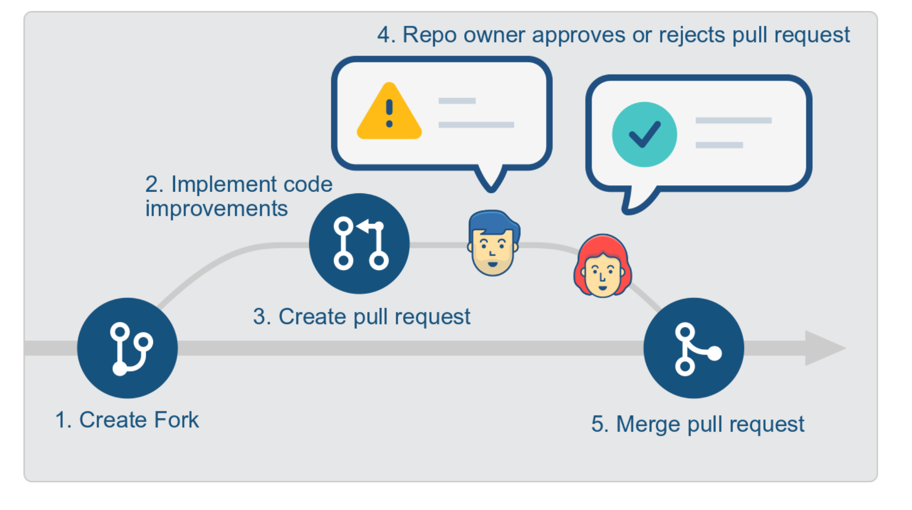

# Peer review assignment 3

## Introduction

Well done on finishing another assignment! Now you will be asked to perform a _peer review_ of another student's code.

The peer review assignment is written to reflect how professional software development is organized. Consider the following example. Sarah owns a project repository and Bill would like to suggest an improvement or new feature to that project.

Bill’s code contribution consists of five steps:

1. Bill creates his own copy of Sarah’s repository. This copy is called a `fork`.
2. Bill implements his improvements or new feature and pushes these changes to his `fork`.
3. Bill sends a request to Sarah to include his changes. He does this by creating a _pull request_. The name pull request refers to the fact that Bill is requesting Sarah to pull his changes into her repository.
4. Sarah reviews Bill’s changes and can either reject or accept the pull request. If rejected, Bill can commit further improvement to his fork until Sarah is happy.
5. Once the pull request is accepted, Sarah merges the pull request. This means that Bill’s code changes will be merged into Sarah’s code repository. Note that this procedure even works if Bill does not have write access to Sarah’s repository.

This _fork-then-pull-request_
is a very common practice in professional code development.

**Note:** As in professional code development, we want you to allot a certain amount of time for the peer review. Please spend a minimum of 1 hour and no more than 4 hours on this assignment. You should spend up to 3 hours reviewing and improving the code, and up to 1 hour writing the comment in the pull request.

## Instructions

To perform the peer review, you will create a copy of the assigned repo (a `fork`) and implement your improvements directly to the code. Once finished, you will request
to include your improvements into the students original repo (i.e. make a a pull request). In the pull request you will also give comments and feedback.

The figure below visualizes these steps. You will perform steps 1-3.

The idea of the “review” is as follows: make constructive changes and use your knowledge and experience to improve the solution. You will actually implement code improvements. You will be assigned randomly one repository and are responsible for one pull-request.

The following list guides you through this process:

1. Visit the repository URL that you need to review, i.e. something like
   https://github.com/UiO-INF3110/IN3110-UiOUser.
2. Click on the ‘Fork’ button on the top right to create your personal copy of the repository.
3. Once forked, you will be forwarded to the repository page of your personal copy.
4. Clone this repository as usual to your computer.
5. Review the code and implement improvements where possible. Commit and push these changes to
   your forked repository.
6. Once you are finished and have committed the improvements, it is time to create a pull request. You create a pull request by visiting the assigned repository (i.e. https://github.com/YourGithubUsername/IN3110-UiOUser) and clicking on `New pull request`. In the description of the pull-request you should summarize and motivate the changes that you have made, as well as insert comments for specific parts of the code.

More information about pull requests can be found on https://help.github.com/articles/about-pull-requests.

## Guidelines

For each (coding) exercise, you should try to address and implement some improvements, such as:

1. Add docstrings where missing and where appropriate.
2. Is the code working as expected? For non-internal functions (in particular for scripts that are run
   from the command-line), does the program handle invalid inputs sensibly? Can you make the code
   more reliable? Does the code need to handle further exceptions that are not yet captured?
3. Is part of the code unreadable or difficult to understand? Simplify the code, add comments where
   required and use classes/functions to avoid duplicate code.
4. Do not comment suggestions on how to improve code quality to the code - you have to actually implement these changes.
   Again: You should implement improvements in a pull-request and not just add suggestions into the code!
5. Is there a potential to improve readability by refactoring and choosing more descriptive variable names?
6. You can try and run the pep8 tool (https://www.python.org/dev/peps/pep-0008/). It automatically checks if standard Python syntax guidelines are followed.

**Note 1:** You can only receive points for the peer-review if you completed assignment 3.

**Note 2:** You need to leave a comment when sending the pull request, where you summarize the changes you made and give general feedback. There will be 2 points withdrawn if no comment is left.

**Note 3:** You do not need to address every problem you find. If you find _one_ problem and fix it in an exercise, that is enough.
The goal is to show us that you have read and understood the code enough to find some improvement.

## Q&A

- _Should we implement missing parts?_ Yes, if that improves the code, you should definitely implement it. But that does _not_ mean you need to complete the whole assignment! Just fixing _some_ missing functionality is enough.
- _I haven’t gotten my repo to review yet, what happened?_ If you asked for an extension, you will be assigned a repository after your extension deadline.
- _Are we expected to review the tasks given for IN4110, even if we have not done them ourselves?_ We recommend that you review all tasks that the student did (even if it is a IN4110 only task and you are a IN3110 student), but we will not be strict about it if you skip it.
- _What do we do if the code we are reviewing is well documented, work as expected, handle invalid inputs, is easy to read, uses utilities functions to avoid duplicate code and (at least seem to) apply all good
  practices we’ve learned?_ In case you received a
  perfect assignment to review, then the most important part of the assignment is to read it carefully and learn from it. In the pull request description you can document that you have spent time on the assignment, for example by writing about the things you learned, the edge cases you considered, etc.
